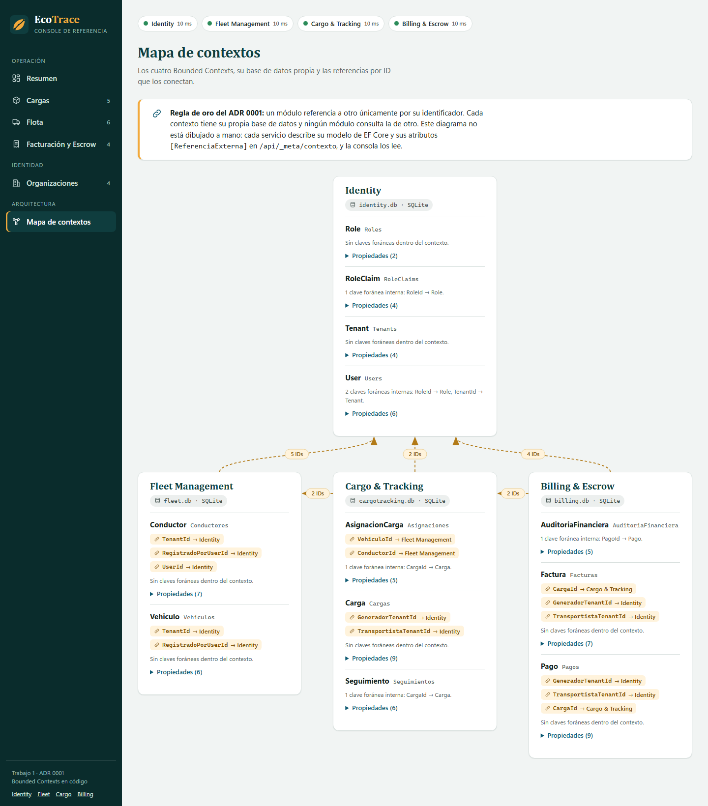

# EcoTrace B2B · Plataforma

La base común del resto del semestre. Cuatro Bounded Contexts en .NET 8 (Identity, Fleet Management, Cargo & Tracking y Billing & Escrow) que se relacionan solo por identificador, y una consola web para verlos funcionar. Implementa lo decidido en los [ADR 0001](../docs/adr/0001-monolito-vs-microservicios.md), [0002](../docs/adr/0002-comunicacion-sincrona-asincrona.md) y [0003](../docs/adr/0003-patron-saga.md): los contextos se relacionan solo por identificador y se comunican por HTTP y por eventos, con un Saga que libera el pago en Escrow y sabe deshacerse.

Esta es la implementación de referencia del Trabajo 2, ya calificado, y la base del Trabajo 3. La solución del Trabajo 1 sigue congelada en [`referencia/trabajo-01/`](../referencia/trabajo-01) como punto de control. Lo que se construya de aquí en adelante se hace en esta carpeta. Los PRs de los escuadrones del Trabajo 2 quedan abiertos como evidencia de lo que entregó cada uno; no se integran.



El diagrama no está dibujado a mano. Cada servicio publica su modelo de EF Core y las referencias externas que declara, y la consola lo dibuja.

## Cómo ejecutarla

Requiere el SDK de .NET 8. Docker es opcional.

```powershell
# Windows (PowerShell)
.\scripts\run-all.ps1
```

```bash
# macOS, Linux o Git Bash
./scripts/run-all.sh
```

```bash
# Con Docker
docker compose up --build
```

Después se abre <http://localhost:5100> y se pulsa **Cargar datos de ejemplo**, que crea organizaciones, flota, cargas en distintos estados y pagos llamando a la API de cada servicio.

| Servicio | Puerto | Base de datos | Swagger |
|---|---|---|---|
| Consola web | 5100 | | |
| Identity | 5101 | `identity.db` | <http://localhost:5101/swagger> |
| Fleet Management | 5102 | `fleet.db` | <http://localhost:5102/swagger> |
| Cargo & Tracking | 5103 | `cargotracking.db` | <http://localhost:5103/swagger> |
| Billing & Escrow | 5104 | `billing.db` | <http://localhost:5104/swagger> |

Cada servicio crea su base SQLite y aplica su migración al arrancar. Para probar:

```bash
dotnet test
```

## Qué hay en la carpeta

```
plataforma/
├── src/
│   ├── EcoTrace.Identity/            Domain · Infrastructure · Api
│   ├── EcoTrace.FleetManagement/     Domain · Infrastructure · Api
│   ├── EcoTrace.CargoTracking/       Domain · Infrastructure · Api
│   ├── EcoTrace.Billing/             Domain · Infrastructure · Api
│   └── EcoTrace.Console/             Consola web (archivos estáticos, sin paso de compilación)
├── tests/EcoTrace.Tests/             Integración, flujo entre contextos y arquitectura
├── docs/
│   ├── decisiones-de-diseno.md       Por qué está hecho así, y qué se dejó fuera
│   ├── brand/README.md               Guía de marca y de interfaz de la consola
│   ├── requests.http                 Peticiones de ejemplo
│   └── img/                          Capturas
├── scripts/                          run-all.ps1, run-all.sh, contraste.py
├── Dockerfile · docker-compose.yml
└── global.json · Directory.Build.props · Directory.Packages.props
```

## Cómo trabajamos sobre esta base

Cada escuadrón es dueño de un contexto y trabaja en su carpeta de `src/`:

| Escuadrón | Carpeta |
|---|---|
| Identity | `src/EcoTrace.Identity/` |
| Fleet Management | `src/EcoTrace.FleetManagement/` |
| Cargo & Tracking | `src/EcoTrace.CargoTracking/` |
| Billing & Escrow | `src/EcoTrace.Billing/` |

Las reglas son cinco:

1. **Cada cambio entra por PR contra `main`.** Desde una rama o desde un fork, con el nombre `feat/<contexto>-<tema>`. Nadie hace push directo a `main`.
2. **Un PR toca la carpeta de un solo contexto**, más las pruebas que le corresponden. Si necesitas un cambio en el contexto de otro escuadrón, se lo pides por Issue o PR y lo revisa su dueño.
3. **Cada persona hace commit con su propia cuenta de GitHub.** En la sustentación individual se revisa quién escribió qué con `git blame`.
4. **El CI tiene que estar en verde.** Compila con las advertencias como errores y corre todas las pruebas, incluidas las de arquitectura que hacen cumplir la regla del ADR 0001. Si una prueba de arquitectura falla, el problema es el cambio, no la prueba.
5. **Los archivos compartidos** (`src/EcoTrace.Console/`, `scripts/`, `docker-compose.yml`, `tests/EcoTrace.Tests/ArquitecturaTests.cs`) se cambian por PR revisado por el docente.

Dentro de un contexto puedes organizar el código como prefieras mientras respetes esa regla y las pruebas. Las decisiones que ya están tomadas y su razón están en [decisiones-de-diseno.md](docs/decisiones-de-diseno.md); léelo antes de proponer un cambio de estructura.

## Qué hace la consola

- **Resumen operativo:** indicadores, cargas por estado y fondos en Escrow, reunidos desde los cuatro servicios.
- **Mapa de contextos:** las entidades de cada contexto, sus referencias por ID y las flechas entre contextos, leídas del modelo real.
- **Cargas, flota, pagos y organizaciones:** listas, formularios con validación y errores del servidor, y paneles de detalle con línea de tiempo.
- **Saga de pago:** cada ejecución con sus cuatro pasos, el estado de cada uno y la compensación cuando falla. La lista sigue el estado que guarda Billing.
- **Outbox de Cargo & Tracking:** los mensajes pendientes, publicados y muertos, con el botón de reproceso.
- **Estado de los servicios:** un indicador por servicio y un aviso si alguno no responde. Las demás pantallas siguen funcionando.

La consola pide cada lista al servicio dueño y resuelve los nombres buscando por identificador. Es una decisión consciente y está explicada en [decisiones-de-diseno.md](docs/decisiones-de-diseno.md).

## Las APIs en resumen

Todas devuelven JSON con los enums como texto y los errores como `ProblemDetails`. Además de lo siguiente, cada servicio expone `GET /health` y `GET /api/_meta/contexto`.

| Servicio | Endpoints |
|---|---|
| Identity | `POST` y `GET /api/tenants`, `GET /api/tenants/{id}`, `GET /api/tenants/{id}/estado`, `POST /api/tenants/{id}/suspension`, `POST /api/tenants/{id}/reactivacion`, `POST` y `GET /api/users`, `GET /api/users/{id}`, `GET /api/roles`, `POST /api/autorizaciones-pago`, `GET /api/autorizaciones-pago/{pagoId}`, `POST /api/autorizaciones-pago/{pagoId}/revocacion` |
| Fleet Management | `POST` y `GET /api/vehiculos`, `GET /api/vehiculos/{id}`, `POST` y `GET /api/conductores`, `GET /api/conductores/{id}`, `POST /api/reservas`, `POST /api/liberaciones`, y con `Simulacion__Habilitada` también `/api/_simulacion/fallos` |
| Cargo & Tracking | `POST` y `GET /api/cargas`, `GET /api/cargas/{id}`, `POST /api/cargas/{id}/asignacion`, `POST` y `GET /api/cargas/{id}/seguimientos`, `GET /api/outbox`, `POST /api/outbox/{eventoId}/reprocesar` |
| Billing & Escrow | `POST` y `GET /api/pagos`, `GET /api/pagos/{id}`, `POST /api/pagos/{id}/liberar`, `POST /api/pagos/{id}/reembolso`, `GET /api/pagos/{id}/auditoria`, `POST` y `GET /api/facturas`, `GET /api/facturas/{id}`, `POST /api/eventos/entrega-confirmada`, `GET /api/sagas`, `GET /api/sagas/{id}` |

Las peticiones de ejemplo del Trabajo 1 están en [docs/requests.http](docs/requests.http), y el recorrido del Saga completo, con la compensación, en [docs/trabajo-02/verificacion.http](docs/trabajo-02/verificacion.http). El contrato exacto de cada ruta está en la [especificación del Trabajo 2](docs/trabajo-02/especificacion.md).

## Lo que todavía no está

- **Autenticación y autorización** (ADR 0004). Hoy los servicios aceptan el `TenantId` que llega en la solicitud sin verificarlo y las rutas no piden token. Es el centro del Trabajo 3. Se explica en [decisiones-de-diseno.md](docs/decisiones-de-diseno.md#5-el-tenantid-llega-en-el-cuerpo-de-la-solicitud).
- **Un broker de mensajes.** Los eventos viajan por HTTP desde el Outbox; el contrato del mensaje es el del ADR, y cambiar a RabbitMQ o Service Bus solo toca el publicador y el punto de recepción.
- **El Saga «Iniciar Transporte»** del ADR 0003 y la resolución de una disputa de pago: `EnDisputa` es un estado final.
- **La app móvil y el despliegue** (ADR 0005 y 0006), también del Trabajo 3.

Los servicios siguen sin validar fuera del Saga que las referencias a otros contextos existan. Dentro del Saga sí se comprueban, y por llamadas, no leyendo bases ajenas.

## Documentos

- [Trabajo 2: especificación de los contratos](docs/trabajo-02/especificacion.md) y [verificación](docs/trabajo-02/verificacion.http)
- [Trabajo 2: referencia, criterio por criterio](docs/trabajo-02/referencia.md): dónde está cada cosa de la rúbrica y qué prueba la demuestra
- [Decisiones de diseño](docs/decisiones-de-diseno.md)
- [Guía de marca y de interfaz](docs/brand/README.md)
- [Peticiones de ejemplo](docs/requests.http)
