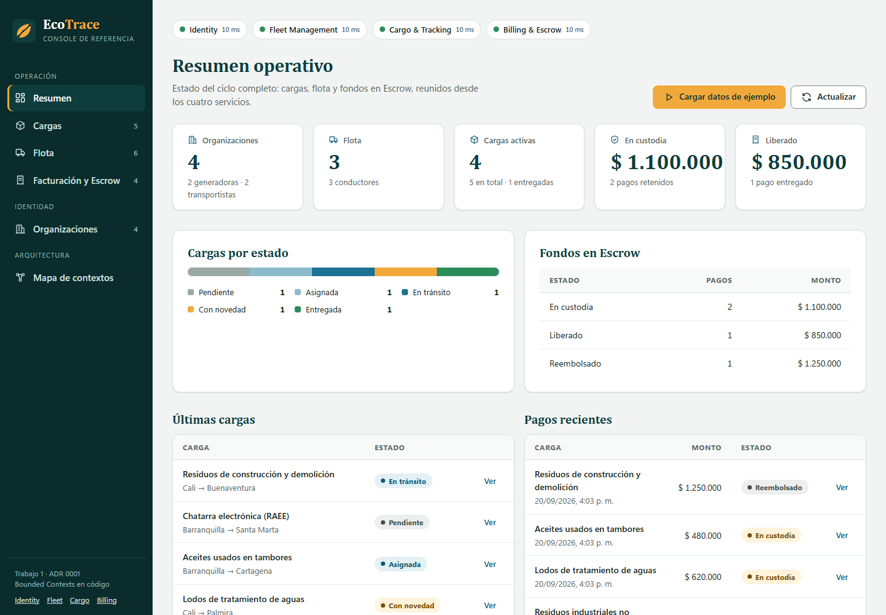
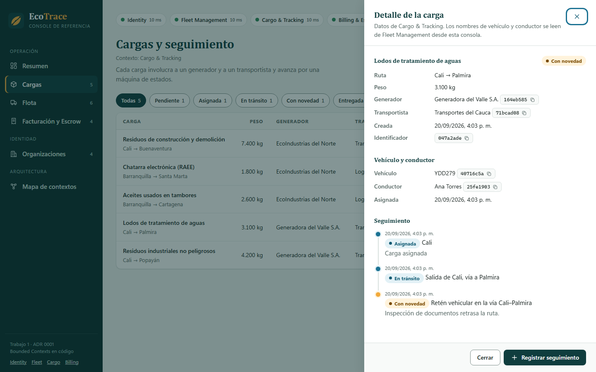
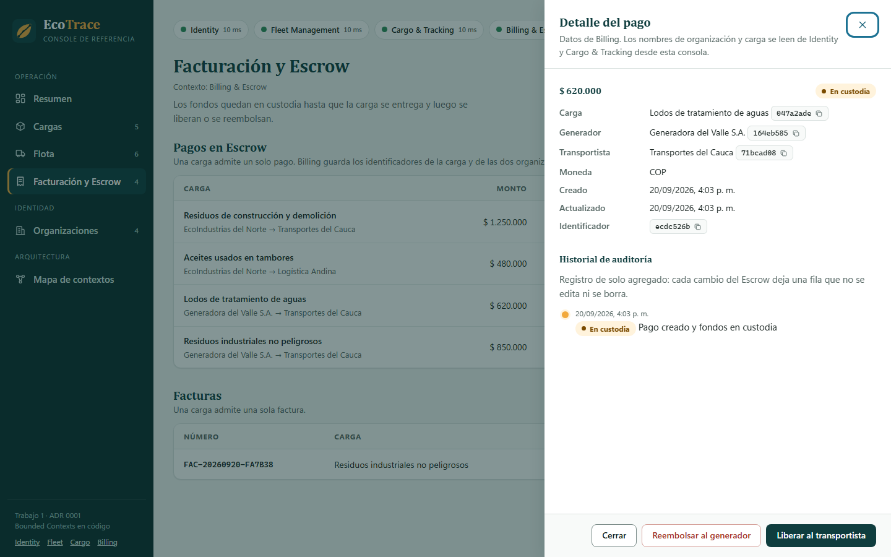

# Guía de marca de EcoTrace Console

Sistema visual de la consola web de la plataforma. Usa la misma paleta y tipografía que las presentaciones del curso. La fuente de verdad en código es [`tokens.css`](../../src/EcoTrace.Console/wwwroot/css/tokens.css): si algo de esta guía y ese archivo difieren, manda el archivo.

## La idea

El símbolo junta dos cosas: una hoja, por los residuos y la regulación ambiental que originan el negocio, y una ruta con tres nodos, por la trazabilidad de cada carga. El nombre es la suma de ambas.

La consola es una herramienta de operación logística y financiera, así que el diseño es sobrio. Los tonos de estado se reservan para significar algo (una novedad, dinero en custodia) y el relleno ámbar de la marca se usa solo en una acción: "Cargar datos de ejemplo".

## Logotipo

| Archivo | Uso |
|---|---|
| [`logo-mark.svg`](../../src/EcoTrace.Console/wwwroot/assets/logo-mark.svg) | Símbolo solo. Favicon y espacios cuadrados. |
| [`logo-horizontal.svg`](../../src/EcoTrace.Console/wwwroot/assets/logo-horizontal.svg) | Símbolo y nombre, para fondos claros. |
| [`logo-horizontal-dark.svg`](../../src/EcoTrace.Console/wwwroot/assets/logo-horizontal-dark.svg) | Símbolo y nombre, para fondos oscuros. |

**Uso**

- Tamaño mínimo: 16 px de alto para el símbolo y 96 px de ancho para la versión horizontal.
- Zona de respeto: al menos la mitad del alto del símbolo por cada lado.
- Sobre fondo claro se usa la versión horizontal; sobre fondo oscuro, la versión `dark`.

**No hacer**

- Cambiar los colores del símbolo ni rotarlo o estirarlo.
- Añadir sombras, contornos o degradados.
- Poner el nombre en otra tipografía.

**Limitación conocida.** En los archivos horizontales el nombre es texto SVG (Cambria, con Georgia como respaldo), no curvas. En un equipo sin esas fuentes se verá distinto. Falta una versión con el texto convertido a trazos.

## Color

Todos los colores están definidos como variables CSS. Los contrastes se calcularon con la fórmula de luminancia relativa de WCAG 2.1 y se pueden reproducir con [`scripts/contraste.py`](../../scripts/contraste.py).

| Variable | Valor | Uso | Contraste |
|---|---|---|---|
| `--ink` | `#16211E` | Texto principal | 16,53:1 sobre blanco |
| `--muted` | `#566764` | Texto secundario | 5,97:1 sobre blanco, 5,39:1 sobre la página |
| `--placeholder` | `#62726F` | Texto de ayuda dentro de campos | 5,05:1 sobre blanco |
| `--brand` | `#0F3D3E` | Titulares, botón primario | 11,95:1 sobre blanco |
| `--brand-deep` | `#0A2C2C` | Barra lateral, avisos | 14,90:1 con texto blanco |
| `--petrol-strong` | `#0F5A73` | Enlaces y textos de información | 7,69:1 sobre blanco |
| `--petrol` | `#1C7293` | Gráficos y detalles | 5,42:1 sobre blanco |
| `--amber` | `#F2A93B` | Acento | Ver la regla siguiente |
| `--line-strong` | `#7C8D8A` | Borde de campos | 3,48:1 sobre blanco (mínimo 3:1 para controles) |

**Regla del ámbar.** Sobre blanco el ámbar da 2,00:1, así que nunca se usa como color de texto sobre fondo claro. Solo se usa como relleno con texto `#0A2C2C` (7,46:1) o como texto sobre fondo oscuro (7,46:1 sobre `#0A2C2C`).

**Estados.** Cada estado tiene un fondo suave y un texto oscuro, con contraste de 5,70:1 a 7,46:1:

| Estado | Texto | Fondo | Contraste |
|---|---|---|---|
| Correcto | `#1E6B3F` | `#E7F3EB` | 5,70:1 |
| Error | `#A83226` | `#FBEAE8` | 5,73:1 |
| Advertencia | `#7A4B00` | `#FFF3DC` | 6,74:1 |
| Información | `#0F5A73` | `#E3F1F6` | 6,66:1 |
| Neutro | `#3F4F4C` | `#ECEFEE` | 7,46:1 |

El color nunca es la única señal. Toda insignia de estado lleva su texto ("En custodia", "Con novedad") y la barra de cargas por estado tiene una leyenda con nombres y conteos.

## Tipografía

| Rol | Familia | Notas |
|---|---|---|
| Titulares | Cambria, con Iowan Old Style, Palatino Linotype y Georgia de respaldo | Peso 700 |
| Cuerpo | Segoe UI Variable, Segoe UI, `system-ui` | 15 px |
| Identificadores y códigos | Cascadia Mono, Consolas, `ui-monospace` | 13 px |

Escala: título de página 30 px, sección 20 px, subsección 17 px, cuerpo 15 px, tablas 14 px, etiquetas 12 a 13 px. Las cifras usan `font-variant-numeric: tabular-nums` en montos, conteos y latencias, para que las columnas queden alineadas.

Las fuentes no se descargan: son las del sistema. La consola funciona sin conexión a internet y no depende de ningún CDN.

## Espacio, forma y elevación

- Escala de espacio de 4 px: 4, 8, 12, 16, 24, 32 y 48.
- Radios: 8 px en controles, 12 px en tarjetas y tablas.
- Dos sombras: una casi imperceptible para tarjetas y otra más marcada para paneles y avisos.

## Iconografía

Íconos de trazo sobre una malla de 24 px: 1,75 px de grosor, extremos redondeados, sin relleno. Están definidos como constantes en [`js/dom.js`](../../src/EcoTrace.Console/wwwroot/js/dom.js). Los íconos acompañan a un texto; ninguno funciona solo.

## Voz y tono

Español neutro, sin tú ni usted: los botones y las instrucciones usan el infinitivo o el imperativo impersonal ("Crear organización", "Compruebe que el servicio está en ejecución"). Frases cortas. Primero se dice qué pasó y después qué hacer.

| Situación | Se escribe | No se escribe |
|---|---|---|
| Error del servidor | "Ya existe un vehículo con esa placa." | "Error 409" |
| Sin datos | "Aún no hay cargas. Una carga involucra a dos organizaciones…" y un botón para crear la primera | "No hay datos" |
| Acción irreversible | "Los $ 620.000 se entregarán a Transportes del Cauca. Esta acción no se puede deshacer." | "¿Está seguro?" |

Se dice *organización* y no *tenant*, salvo cuando se habla del campo técnico. Los montos se muestran en pesos colombianos sin decimales y las fechas con el formato local de `es-CO`.

## Accesibilidad

Lo que se verificó:

- Contraste AA en todos los pares de texto (ver la tabla y `scripts/contraste.py`).
- Foco visible de 3 px en todos los controles.
- Enlace "Saltar al contenido" al principio de la página.
- Tablas con `<caption>` y encabezados con `scope`; formularios con etiquetas y `aria-describedby`; errores de formulario con `role="alert"`.
- Se respeta `prefers-reduced-motion`.
- Los paneles usan `<dialog>` nativo, que atrapa el foco y se cierra con Esc.
- Los avisos son un `popover`, porque un diálogo modal tapa todo lo que no esté en la capa superior del navegador y los mensajes de error quedarían ocultos.
- La consola se ve sin desbordar en 375 px de ancho.

Lo que **no** se verificó: el recorrido con un lector de pantalla real. Se revisó el árbol de accesibilidad del navegador (roles, nombres y estados), pero eso no reemplaza una prueba con NVDA o VoiceOver.

## Capturas

