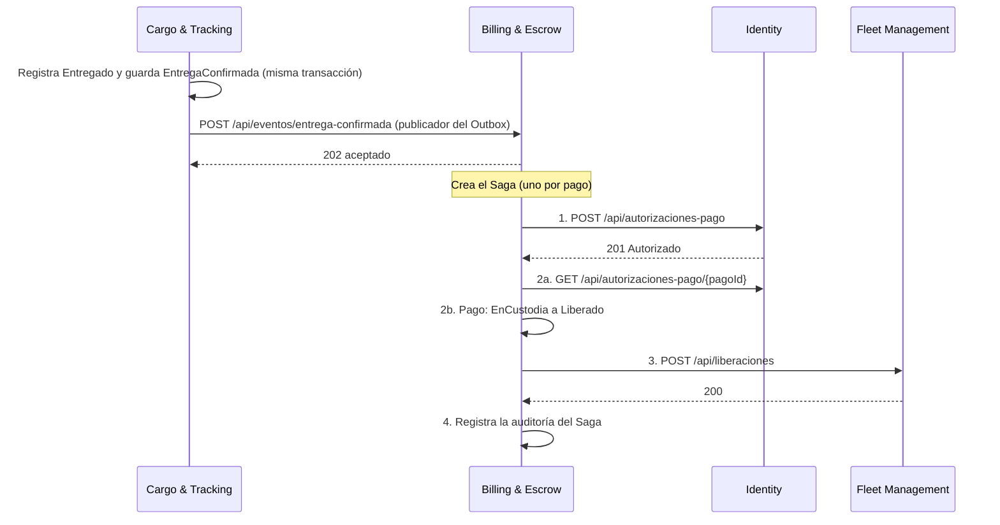

# Trabajo 2 · Especificación

Qué se construye en el Trabajo 2 ([Issue #23](https://github.com/CSA-DanielVillamizar/ecotrace-b2b-core/issues/23)), escrito como contrato: rutas, cuerpos, códigos de respuesta y reglas de cada servicio. Cada escuadrón implementa su parte contra este documento, y lo que un escuadrón espera de otro está aquí y no en una conversación de pasillo.

Se apoya en el [ADR 0002](../../../docs/adr/0002-comunicacion-sincrona-asincrona.md) (comunicación) y en el [ADR 0003](../../../docs/adr/0003-patron-saga.md) (Saga). Donde este documento precisa o cambia algo de los ADR, está anotado en la sección [Diferencias con los ADR](#diferencias-con-los-adr).

## Alcance

Se implementa el Saga **Liberar Pago en Escrow** con Billing como orquestador. Los cuatro escuadrones participan:

| Escuadrón | Qué entrega |
|---|---|
| **Cargo & Tracking** | Al registrar la entrega, guarda el evento `EntregaConfirmada` en un Outbox dentro de la misma transacción, y un publicador lo envía a Billing con reintentos y cola de mensajes muertos. |
| **Billing & Escrow** | Recibe el evento y orquesta el Saga: cuatro pasos con estado guardado, reintentos, y compensación real si algo falla. |
| **Identity** | Estado de la organización y autorización de pago (con su revocación como compensación). |
| **Fleet Management** | Reservar y liberar vehículo y conductor, de forma idempotente. Además, un modo de fallo simulado para poder demostrar la compensación. |

El Saga "Iniciar Transporte" del ADR 0003 no se pide en este trabajo. La reserva de recursos que necesita el Saga de pago se hace con un endpoint simple de Fleet (`POST /api/reservas`), que se llama a mano o desde la consola.

## El flujo



Si el paso 3 falla después de agotar sus intentos, el Saga compensa en orden inverso: el pago pasa de `Liberado` a `EnDisputa` y Billing pide a Identity que revoque la autorización.

## Billing & Escrow

### Recibir el evento

`POST /api/eventos/entrega-confirmada`

```json
{
  "eventId": "uuid",
  "eventType": "EntregaConfirmada",
  "occurredAt": "2026-09-29T15:04:05Z",
  "cargaId": "uuid",
  "vehiculoId": "uuid",
  "conductorId": "uuid",
  "generadorTenantId": "uuid",
  "transportistaTenantId": "uuid",
  "correlationId": "texto"
}
```

`eventId`, `cargaId`, `vehiculoId` y `conductorId` son obligatorios. Billing busca el pago por `cargaId`.

| Respuesta | Cuándo |
|---|---|
| `202` con `{ "resultado": "aceptado", "sagaId": "uuid" }` | El evento se guardó y el Saga quedó creado. El dinero todavía no se movió. |
| `200` con `{ "resultado": "duplicado" }` | Ese `eventId` ya se procesó, o el pago ya tiene un Saga iniciado por otro evento. |
| `400` | Falta un campo obligatorio o `eventType` no es `EntregaConfirmada`. |
| `404` | No existe un pago para esa `cargaId`. |
| `409` | Los tenants del evento no coinciden con los del pago, o el pago ya no está `EnCustodia`. |

Los `4xx` son permanentes para el publicador de Cargo: repetirlos no los arregla. Un `5xx` o un tiempo agotado sí se reintenta.

### El Saga

Hay un solo Saga por pago (clave única sobre `pagoId`). Su estado y el de cada paso se guardan en la base de Billing, de modo que un reinicio del servicio continúa desde el último paso guardado.

| Paso | Qué hace | Compensación |
|---|---|---|
| 1. `AutorizarPago` | Pide la autorización a Identity para el transportista del pago. | Revocarla en Identity. |
| 2. `LiberarFondos` | Verifica en Identity que la autorización sigue `Autorizado` y pasa el pago de `EnCustodia` a `Liberado`. | Pasar el pago de `Liberado` a `EnDisputa`. |
| 3. `LiberarRecursos` | Pide a Fleet liberar vehículo y conductor. | No tiene. Se reintenta, y si se agotan los intentos el Saga compensa los pasos 1 y 2. |
| 4. `RegistrarAuditoria` | Deja constancia de que el Saga terminó. | No tiene. |

Estados del Saga: `EnCurso`, `Completada`, `Compensando`, `Compensada`, `Fallida`, `RequiereIntervencion`.

- **`Fallida`**: falló antes de que se completara ningún paso compensable. No hubo nada que deshacer (por ejemplo, la organización está suspendida).
- **`Compensada`**: falló más adelante y todo lo que se había hecho quedó revertido.
- **`RequiereIntervencion`**: la compensación misma no pudo terminar (por ejemplo, Identity no responde al revocar). El Saga se detiene y deja un registro `Error` con el prefijo `ALERTA` para que una persona actúe.

Estados de un paso: `Pendiente`, `Completado`, `Fallido`, `Compensado`.

Reglas que tiene que cumplir el orquestador:

- **Un paso a la vez, guardando entre uno y otro.** Si el proceso muere entre dos pasos, el Saga sigue donde quedó.
- **Los pasos que solo cambian a Billing se guardan con la marca de "completado" en una sola transacción.** Así no puede quedar el pago liberado sin que el Saga lo sepa.
- **Un ejecutor concurrente no duplica nada.** Si dos procesos avanzan el mismo Saga a la vez, uno gana al guardar y el otro se aparta sin dejar rastro.
- **Compensar en orden inverso**, empezando por el paso completado más reciente que tenga compensación.
- **Cada acción queda en la auditoría del pago** (`GET /api/pagos/{id}/auditoria`), incluida la liberación, la reversión y la revocación.

Política de reintentos y tiempos:

| Llamada | Tiempo por intento | Reintentos | Si no responde |
|---|---|---|---|
| Billing a Identity (pasos 1 y 2) | 500 ms | 2, esperando 100 ms y 200 ms | El paso falla y el Saga **falla cerrado**: sin respuesta de Identity no se mueve dinero. |
| Billing a Fleet (paso 3) | 3 s | 3, esperando 2 s, 4 s y 8 s | Se agotan los cuatro intentos y el Saga compensa. |
| Billing a Identity (revocar) | 500 ms, con los mismos 2 reintentos rápidos | Hasta 4 intentos del paso en total, esperando 2 s, 4 s y 8 s entre ellos | Pasa a `RequiereIntervencion`. |

Los reintentos solo aplican a fallos transitorios (red caída, tiempo agotado, `5xx`, `408`, `429`). Un `4xx` es permanente y no se repite. Un `404` al revocar significa que Identity no tiene nada que revocar, y cuenta como éxito.

### Consultar el Saga

- `GET /api/sagas?estado=&pagoId=` lista los Sagas.
- `GET /api/sagas/{id}` devuelve el Saga con sus pasos.

```json
{
  "sagaId": "uuid",
  "pagoId": "uuid",
  "cargaId": "uuid",
  "estado": "Compensada",
  "motivo": "No se pudieron liberar los recursos: Fleet respondió 503: ...",
  "correlationId": "texto",
  "pasos": [
    { "orden": 1, "nombre": "AutorizarPago", "compensable": true, "estado": "Compensado", "intentos": 0, "intentosCompensacion": 0, "detalle": "Autorización revocada en Identity" }
  ]
}
```

### Cambios en el pago

`estadoEscrow` gana un valor: **`EnDisputa`**. Un pago pasa a `EnDisputa` solo desde `Liberado`, como compensación del Saga. Resolver una disputa queda fuera de este trabajo.

## Identity

### Estado de la organización

- `GET /api/tenants/{id}/estado` devuelve `{ "tenantId": "uuid", "estado": "Activo" | "Suspendido", "version": 1 }`, o `404`. Es la fuente autoritativa: nadie mueve dinero basándose en una copia local.
- `POST /api/tenants/{id}/suspension` y `POST /api/tenants/{id}/reactivacion` cambian el estado. Son idempotentes: repetirlos responde `200` sin cambios. `version` empieza en 1 y sube solo cuando el estado cambia.
- `TenantResponse` incluye ahora `estado` y `version`.

### Autorización de pago

`POST /api/autorizaciones-pago`

```json
{ "pagoId": "uuid", "tenantId": "uuid" }
```

| Respuesta | Cuándo |
|---|---|
| `201` | Autorización nueva. |
| `200` | Ya existía una `Autorizado` para ese `pagoId` y ese `tenantId`. Devuelve la misma. |
| `400` | El tenant no es `Transportista`. |
| `404` | No existe el tenant. |
| `409` | El tenant está `Suspendido`, o el pago ya se autorizó para otro tenant, o la autorización de ese pago fue revocada. |

Cuerpo de la respuesta:

```json
{
  "autorizacionId": "uuid",
  "pagoId": "uuid",
  "tenantId": "uuid",
  "estado": "Autorizado",
  "creadoEn": "2026-09-29T15:04:05Z",
  "actualizadoEn": "2026-09-29T15:04:05Z"
}
```

- `POST /api/autorizaciones-pago/{pagoId}/revocacion` marca la autorización `Revocado`. Es idempotente. `404` si no hay autorización para ese pago.
- `GET /api/autorizaciones-pago/{pagoId}` devuelve la autorización, o `404`.

Reglas: hay una autorización por `pagoId` (clave única), nunca se borra, y una revocada no se reutiliza. Dos solicitudes simultáneas para el mismo pago dejan una sola autorización: la que pierde la carrera responde con el resultado de la que ganó.

## Fleet Management

`Vehiculo` y `Conductor` ganan `estado` (`Disponible` o `Reservado`) y `reservadoParaCargaId`, que aparecen en sus respuestas. El estado es un token de concurrencia.

Los dos endpoints reciben el mismo cuerpo y mueven vehículo y conductor juntos: o cambian los dos o no cambia ninguno.

```json
{ "cargaId": "uuid", "vehiculoId": "uuid", "conductorId": "uuid" }
```

Respuesta de los dos:

```json
{
  "cargaId": "uuid",
  "vehiculoId": "uuid",
  "conductorId": "uuid",
  "estadoVehiculo": "Disponible",
  "estadoConductor": "Disponible",
  "cambioEstado": true
}
```

`cambioEstado` es `false` cuando la operación ya estaba aplicada.

- `POST /api/reservas`: `201` si reservó, `200` si ya estaban reservados para esa misma carga, `404` si falta alguno, `400` si son de transportistas distintos, `409` si alguno ya está reservado para otra carga. Dos reservas simultáneas del mismo vehículo no pueden ganar las dos.
- `POST /api/liberaciones`: `200` siempre que funcione, haya cambiado algo o no. `404` si falta alguno, `409` si alguno está reservado para otra carga.

### Fallo simulado

Para poder demostrar el reintento y la compensación sin apagar servicios, Fleet acepta:

- `POST /api/_simulacion/fallos` con `{ "operacion": "liberaciones", "cantidad": 2 }`: las próximas 2 llamadas a `/api/liberaciones` responden `503`. Con `cantidad: 0` se restablece.
- `GET /api/_simulacion/fallos`: cuántos fallos le quedan a cada operación.

Solo funciona si la configuración `Simulacion:Habilitada` es `true`. Por defecto es `false` y estas rutas responden `404`, como si no existieran.

## Cargo & Tracking

### Outbox

Cuando `POST /api/cargas/{id}/seguimientos` registra el estado `Entregado`, guarda en la **misma transacción** un mensaje `EntregaConfirmada` en una tabla de Outbox. Si el guardado falla, no queda ni la entrega ni el mensaje. Ningún otro estado genera mensaje, y un `Entregado` repetido es un `409` que no agrega uno segundo.

El mensaje lleva el cuerpo que Billing espera (ver arriba). `eventId` identifica al mensaje y `correlationId` es el que traía la solicitud de entrega en el encabezado `X-Correlation-Id`, o uno nuevo si no venía.

Estados de un mensaje: `Pendiente`, `Publicado`, `Muerto`.

### Publicador

Un proceso en segundo plano toma los mensajes `Pendiente` cuya hora de reintento ya llegó y hace `POST` a `{Billing}/api/eventos/entrega-confirmada` con los encabezados `X-Correlation-Id` y `Idempotency-Key` (el `eventId`).

- **`2xx`**: `Publicado`.
- **`4xx`** (salvo `408` y `429`): fallo permanente. El mensaje pasa a `Muerto` de inmediato.
- **Red caída, tiempo agotado (3 s), `5xx`, `408` o `429`**: fallo transitorio. Se cuenta el intento y se agenda el siguiente con espera exponencial: 2 s, 4 s, 8 s, 16 s… Al llegar a 6 intentos, `Muerto`.
- Cuando un mensaje queda `Muerto`, se registra un `Error` con el prefijo `ALERTA`.

La entrega es "al menos una vez": si el proceso cae después de enviar y antes de marcar `Publicado`, el mensaje se reenvía. Por eso Billing deduplica por `eventId`.

### Operación

- `GET /api/outbox?estado=` lista los mensajes (`intentos`, `ultimoError`, `proximoIntentoEn`).
- `POST /api/outbox/{eventoId}/reprocesar` devuelve un mensaje `Muerto` a `Pendiente` con los intentos en cero. `409` si no está `Muerto`.

## Reglas comunes

- **`X-Correlation-Id`.** Cada servicio lee el encabezado de la solicitud, o genera uno si no viene o no es válido (hasta 64 caracteres: letras, números, guion y guion bajo), lo devuelve en la respuesta y lo incluye en sus registros. Todas las llamadas de un mismo Saga llevan el mismo.
- **Los identificadores de mensajes y de trazas son texto, no `Guid`.** La prueba de arquitectura marca como referencia externa todo `Guid` cuyo nombre termine en `Id` y no sea clave, así que un `eventId` o un `correlationId` guardado como `Guid` hay que declararlo. Guardarlos como `string` es lo correcto: identifican un mensaje o una traza, no una entidad de otro contexto.
- **Nada de bases de datos compartidas ni de proyectos compartidos.** Cada servicio declara sus propios contratos. Entre servicios solo viajan identificadores.
- **Las direcciones de los otros servicios salen de la configuración**, con `http://localhost:510x` como valor por defecto y el nombre del servicio en Docker.

## Pruebas de arquitectura: una regla cambia

`Identity_es_el_dominio_base_y_no_referencia_a_nadie` deja de ser cierta con este trabajo: la autorización de pago se identifica por el `PagoId` de Billing. Ese `Guid` se declara con `[ReferenciaExterna("Billing", ...)]`, como cualquier otro, y la prueba tiene que actualizarse para permitir esa única referencia y ninguna más.

`ArquitecturaTests.cs` es un archivo compartido: el cambio va en un PR del escuadrón de Identity, revisado por el docente, y explica en la descripción por qué la regla cambia. Cambiar una prueba de arquitectura para que pase sin esa explicación es exactamente lo que la prueba existe para evitar.

## Diferencias con los ADR

| Tema | Lo que dicen los ADR | Lo que se hace aquí, y por qué |
|---|---|---|
| Carga útil de `EntregaConfirmada` | Incluye `paymentId`, `amount`, `currency` y `deliveryCertificateId`. | No lleva pago ni monto: Cargo & Tracking no conoce el pago (regla de oro del ADR 0001). Billing lo encuentra por `cargaId`. Sí lleva `vehiculoId` y `conductorId`, que Billing necesita para el paso 3. |
| Transporte de los eventos | Un broker (RabbitMQ o Azure Service Bus). | HTTP entre servicios. El contrato del mensaje (identificador, correlación, entrega al menos una vez, deduplicación) es el del ADR; cambiar a un broker solo toca el publicador y el punto de recepción. |
| Cola de mensajes muertos | Una DLQ del broker. | El estado `Muerto` en la tabla del Outbox, con su ruta de reproceso. |
| Autorización desde Identity por gRPC | `Billing → Identity.ValidateTenantStatus` sobre gRPC. | HTTP con los mismos tiempos y reintentos. El contrato de resiliencia (500 ms, 2 reintentos, falla cerrado) no cambia. |
| Compensación de Billing | "Genera una nota de débito interna y emite un comando para congelar nuevamente los fondos". | El pago pasa a `EnDisputa` y la reversión queda en la auditoría, que hace de nota de débito. No hay proveedor financiero real al que enviar un comando. |
| Eventos `TenantSuspended` y `TenantReactivated` | Identity los publica y Billing mantiene una proyección local. | Fuera de este trabajo. Billing pregunta a Identity en cada Saga, que es la fuente autoritativa. |

## Qué no se pide

- Autenticación y JWT (Trabajo 3).
- El Saga "Iniciar Transporte".
- Un broker de mensajes real.
- Resolver una disputa (`EnDisputa` es un estado final para este trabajo).
- Una interfaz nueva. Con Swagger y [verificacion.http](verificacion.http) alcanza para la demo; si un escuadrón quiere agregar una vista a la consola, es opcional y va en un PR aparte.

## Cómo comprobar tu parte

[verificacion.http](verificacion.http) tiene las llamadas de cada contrato en orden. Sirven para revisar tu servicio y también el de otro escuadrón, que es lo que se hace en la revisión cruzada del PR.

La demo del jueves 1 de octubre recorre dos casos con los cuatro servicios corriendo:

1. **Camino feliz.** Se registra una entrega y se ve, en `GET /api/sagas`, cómo el Saga pasa por los cuatro pasos hasta `Completada`, con el pago en `Liberado`, la autorización en `Autorizado` y el vehículo `Disponible`.
2. **Compensación.** Se arman fallos en Fleet, se registra otra entrega y se ve el Saga reintentar cuatro veces, terminar `Compensada`, con el pago en `EnDisputa`, la autorización `Revocado` y el vehículo todavía `Reservado`.
