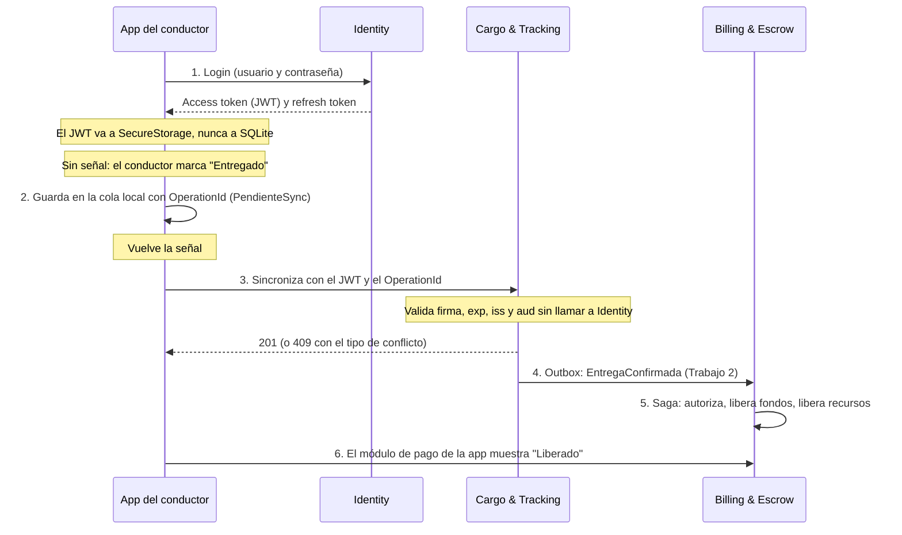

# Trabajo 3 · Especificación

Qué se construye en el Trabajo 3, el capstone ([Issue #25](https://github.com/CSA-DanielVillamizar/ecotrace-b2b-core/issues/25)), escrito como contrato: quién entrega qué, qué rutas y qué respuestas se esperan, y cómo se comprueba. Cada escuadrón implementa su parte contra este documento, y lo que un escuadrón espera de otro está aquí.

Se apoya en el [ADR 0004](../../../docs/adr/0004-oauth2-jwt.md) (OAuth2 y JWT), el [ADR 0005](../../../docs/adr/0005-offline-first-maui.md) (offline-first en .NET MAUI) y el [ADR 0006](../../../docs/adr/0006-despliegue-smartphones.md) (despliegue en smartphones). Donde este documento precisa o cambia algo de los ADR, está en [Diferencias con los ADR](#diferencias-con-los-adr).

## Qué se construye

Una sola app del conductor, en .NET MAUI, y el backend que la protege. La demo recorre esta cadena completa:

Cada escuadrón construye **su módulo** de esa cadena. Los tres ADR ya describen la app módulo por módulo (Identity: sesión y token; Fleet: ruta y vehículo; Cargo: cargas y entrega; Billing: estado de pago), así que el reparto sigue los mismos escuadrones del Trabajo 2.

| Escuadrón | Seguridad (ADR 0004) | Móvil (ADR 0005) | Despliegue (ADR 0006) |
|---|---|---|---|
| **Identity** | Es el Authorization Server: emite y revoca tokens, publica la clave pública. | Login, sesión y `SecureStorage`; sesión offline degradada con biometría. | Checklist de release del módulo de sesión. |
| **Fleet Management** | Resource Server: valida el JWT y autoriza por rol y organización. | Módulo de vehículo y conductor, con una acción encolada. | Checklist de release del módulo. |
| **Cargo & Tracking** | Resource Server, con el endpoint más crítico: confirmar una entrega. | Módulo de cargas y confirmación de entrega. Es el que dispara el Saga. | Checklist de release del módulo. |
| **Billing & Escrow** | Resource Server con control de roles para operaciones de dinero. | Módulo de estado de pago, con una acción encolada. | Checklist de release del módulo. |

Además, **todos** participan en tres piezas compartidas: la cadena de la demo, el pipeline de release (se describe más abajo) y las pruebas de ataque a los tokens.

## Base de código y lo que entrega el docente

La base es `plataforma/` con el resultado del Trabajo 2 (Saga, Outbox, contratos entre servicios). El docente agrega dos cosas para que ningún escuadrón dependa de otro en la primera semana:

- `plataforma/src/EcoTrace.Mobile.Core/`: biblioteca .NET 8 (sin MAUI, se prueba en cualquier máquina) con la tabla de la cola local, el enum de estados, el motor que sincroniza en orden, la clasificación de conflictos y las interfaces que cada módulo implementa.
- `plataforma/src/EcoTrace.App/`: la app MAUI (Android) con el menú, el banner de "Sin conexión" y un módulo vacío por escuadrón: `Modulos/Identity`, `Modulos/Fleet`, `Modulos/Cargo` y `Modulos/Billing`. Cada escuadrón trabaja solo en su carpeta.

Se publica a más tardar el **lunes 12 de octubre**. Hasta entonces, cada escuadrón trabaja en el backend.

## Seguridad (ADR 0004)

### Identity: emitir y revocar

| Ruta | Qué hace |
|---|---|
| `POST /api/auth/login` | Recibe `email` y `password`. Responde `200` con `accessToken`, `refreshToken` y `expiraEn`. Si falla, responde `401` con el mismo mensaje genérico ("Credenciales inválidas") sin decir qué campo falló. |
| `POST /api/auth/refresh` | Cambia un refresh token vigente por un access token nuevo. `401` si está vencido, revocado o no existe. |
| `POST /api/auth/logout` | Revoca el refresh token. Es idempotente: revocar uno ya revocado responde `200`. |
| `GET /.well-known/jwks.json` | Publica la clave pública con la que se firma, con su `kid`. |
| `POST /api/auth/token-servicio` | Emite un token para llamadas entre servicios (ver más abajo). |

Reglas del token:

- **Algoritmo RS256.** Se firma con una clave privada que nunca está en el repositorio: sale de configuración o de una variable de entorno. Los demás módulos solo conocen la clave pública.
- **Claims:** `sub` (UserId), `tenant_id`, `role`, `iss`, `aud`, `iat`, `exp` y `jti`. `aud` es una lista con los módulos para los que sirve el token (`ecotrace-fleet`, `ecotrace-cargo`, `ecotrace-billing`, `ecotrace-identity`).
- **Duración:** access token de 15 minutos y refresh token de 7 días. El refresh token se guarda en la base de Identity **como hash**, nunca en claro, y se puede revocar.
- **Contraseñas:** `User` gana un hash de contraseña (PBKDF2 o `PasswordHasher` de ASP.NET). Ninguna otra pieza del sistema ve una contraseña. Nada de contraseñas, tokens completos ni claves en los registros.
- **Identity también es Resource Server de sí mismo:** sus rutas administrativas (suspender una organización, crear usuarios) exigen un token válido con rol `Administrador`.

### Token de servicio (llamadas entre servicios)

En el Trabajo 2 los servicios se llaman entre sí sin identidad. Con el Trabajo 3 eso se cierra: Billing llama a Identity y a Fleet en el Saga, y Cargo llama a Billing desde el Outbox. Esas llamadas llevan un **token de servicio**.

- `POST /api/auth/token-servicio` recibe `clientId` y `clientSecret` (de configuración de cada servicio) y emite un token de 5 minutos con `role = Servicio` y `aud` del módulo destino.
- Las rutas internas (`/api/reservas`, `/api/liberaciones`, `/api/autorizaciones-pago`, `/api/eventos/*`) aceptan el rol `Servicio`, y los usuarios finales no pueden llamarlas.

### Resource Servers: Fleet, Cargo y Billing

Antes de confiar en cualquier claim, cada módulo verifica **en este orden**: firma (con la clave pública de Identity), `exp`, `iss` y `aud`. Si una falla, responde `401` y no intenta arreglar el token.

- **Local, sin red.** El módulo descarga el JWKS una vez, lo guarda en memoria y lo renueva cuando aparece un `kid` desconocido, no en cada solicitud. Si Identity está caído, un token válido sigue validándose.
- **`401` y `403`.** `401` es token ausente, mal firmado, vencido o de otro emisor o audiencia. `403` es un token válido que no tiene permiso para esa operación. El cuerpo del `401` es genérico: el motivo exacto va al registro del servidor, no al cliente.
- **Tolerancia de reloj** de 30 segundos como máximo.
- **Aislamiento por organización.** El `tenant_id` sale del token, nunca de un parámetro del cliente. Una persona de una organización no puede leer ni cambiar datos de otra (`403`).

Matriz mínima de permisos (se aceptan permisos adicionales si están documentados):

| Módulo | Operación | Quién puede |
|---|---|---|
| Cargo | `POST /api/cargas/{id}/seguimientos` con estado `Entregado` | `Conductor` o `Supervisor` del transportista de esa carga |
| Cargo | `GET /api/cargas` | Cualquier rol de las organizaciones de la carga; la lista se filtra con el `tenant_id` del token |
| Fleet | `POST /api/vehiculos`, `POST /api/conductores` | `Supervisor` o `Administrador` del transportista dueño |
| Billing | `POST /api/pagos/{id}/liberar` y `reembolso` | `Administrador` de una organización del pago |
| Billing | `GET /api/pagos` | Roles de las organizaciones del pago; filtrado por `tenant_id` |
| Rutas internas | Reservas, liberaciones, autorizaciones, eventos | Solo `Servicio` |

El rol de "despachador" que menciona el ADR 0004 corresponde al rol `Supervisor` que ya existe en Identity.

### Pruebas de ataque

Cada Resource Server entrega pruebas automáticas que demuestran el rechazo limpio de estos casos:

| Caso | Respuesta esperada |
|---|---|
| Sin token | `401` |
| Token vencido (`exp` en el pasado) | `401` |
| Firma alterada (un byte cambiado) | `401` |
| `alg: none` | `401` |
| `iss` de otro entorno | `401` |
| `aud` de otro módulo | `401` |
| Token válido de otra organización | `403` |
| Token válido con un rol sin permiso | `403` |

## Móvil offline-first (ADR 0005)

### La regla de oro

Toda acción del conductor sigue el mismo ciclo: (1) se guarda en SQLite con estado `PendienteSync` antes de tocar la red, (2) la pantalla se actualiza de inmediato, (3) se sincroniza en segundo plano cuando hay conexión y en el orden en que se encolaron, (4) nunca se pierde una acción en silencio.

### La cola local

La cola es una tabla con estos campos. La define el `Mobile.Core`; los módulos no la rehacen.

| Campo | Qué es |
|---|---|
| `OperationId` | `Guid` generado **en el dispositivo, al guardar la acción**, no al sincronizar. |
| `Modulo` y `Tipo` | Qué módulo y qué acción (por ejemplo `Cargo` y `ConfirmarEntrega`). |
| `Payload` | El cuerpo de la solicitud, en JSON. |
| `Estado` | `PendienteSync`, `Sincronizando`, `Sincronizado` o `Rechazado`. Es el único vocabulario permitido. |
| `TipoConflicto` | `A`, `B`, `C` o vacío. |
| `MotivoRechazo` y `Intentos` | Lo que respondió el servidor y cuántas veces se intentó. |

### Lo que el servidor debe cumplir

- **Idempotencia por `OperationId`.** Toda ruta que la app llama para cambiar algo recibe el encabezado `Idempotency-Key` con el `OperationId`. Si llega el mismo valor otra vez, el servidor responde `200` con el resultado anterior y **no repite el efecto**. Es la prueba de que un reintento tras un corte de red no duplica nada (en Cargo, que no se dispare dos veces el Saga).
- **Tipo de conflicto en la respuesta.** Cuando rechaza, responde `409` (o `400` para validaciones) con un `ProblemDetails` que incluye la propiedad `tipoConflicto`:

| `tipoConflicto` | Qué significa | Qué hace la app |
|---|---|---|
| `A` | Validación recuperable: el dato local no cumple una regla, pero se puede corregir. | Muestra el motivo y deja corregir y reintentar. |
| `B` | Estado autoritativo: el servidor cambió mientras el conductor estaba sin conexión (carga reasignada, ruta cancelada, pago ya liberado). | El servidor gana. La acción pasa a `Rechazado` y se conserva para auditoría; no hay reintento automático. |
| `C` | Edición concurrente: dos personas legítimas cambiaron lo mismo. | Muestra las dos versiones o la envía a revisión. Nunca "gana el último que sincroniza". |

### Seguridad en el dispositivo

- El JWT y el refresh token viven en `SecureStorage`. **Nunca** en SQLite, en `Preferences` ni en texto plano.
- El login **no se encola jamás**: la app no guarda la contraseña para reintentarla.
- **Sesión offline degradada.** Si el token venció y no hay señal, la app permite seguir con una sesión local protegida por biometría (o por el PIN del dispositivo si el emulador no tiene biometría), con dos límites: dura como máximo **48 horas** desde el último contacto real con Identity, y no permite acciones que muevan dinero ni cierren un ciclo de negocio crítico. Las acciones hechas en esa sesión se autorizan, al sincronizar, con el **JWT nuevo**, nunca con el vencido.

### Qué entrega cada módulo de la app

| Módulo | Qué muestra y guarda en caché | Acción encolada | Conflicto de ejemplo que debe poder demostrar |
|---|---|---|---|
| **Identity** | Sesión, datos del último login, fecha de última sincronización. | Cambio de datos de perfil y cierre de sesión en otros dispositivos. | `A`: teléfono con formato inválido. `B`: organización suspendida. |
| **Fleet** | Vehículo y conductor asignados, con su estado. | Reportar una novedad del vehículo (`POST /api/vehiculos/{id}/novedades`, ruta nueva). | `B`: el vehículo fue reservado para otra carga mientras no había señal. |
| **Cargo** | Cargas asignadas, estado, próxima parada, fecha de última sincronización. | Cambio de estado de la carga, incluida la confirmación de entrega. | `B`: la carga fue reasignada a otro conductor. |
| **Billing** | Pagos de su organización con su estado (`EnCustodia`, `Liberado`, `EnDisputa`). | Registrar evidencia de entrega (`POST /api/pagos/{id}/evidencias`, ruta nueva). | `B`: el pago ya fue liberado por otro proceso. |

Si un escuadrón prefiere otra acción encolada (por ejemplo, iniciar y finalizar un tramo en Fleet, como en el ADR), puede proponerla por Issue antes del primer checkpoint. Se evalúa el patrón (cola, `OperationId`, conflicto tipado), no la entidad elegida.

El **banner** de "Sin conexión" es un componente único, del `Mobile.Core`, y aparece en todas las pantallas sin señal: *"Sin conexión. Mostrando datos guardados. Última sincronización: 10:30 a. m."*

## Despliegue (ADR 0006)

### Entornos

Hay dos entornos que no se mezclan: **desarrollo** y **producción simulado**. En esta entrega "producción" es un segundo conjunto de servicios levantado con otra configuración, en otros puertos y con otra clave de firma.

- La URL base y el emisor salen de `appsettings.Production.json` (o su equivalente en MAUI), nunca de constantes en el código ni de la configuración de desarrollo.
- Cada servicio expone `GET /api/_meta/entorno` y responde `{ "servicio": "...", "entorno": "desarrollo" | "produccion", "version": "..." }`. Es lo que permite comprobar el entorno real sin confiar en una variable.
- El emisor (`iss`) del token es distinto en cada entorno, así que un token de desarrollo no sirve contra producción.

### Verificación en dos capas

Ningún checklist se queda en revisar la configuración.

1. **Capa 1, configuración:** el build es Release (no Debug) y la URL sale de la configuración de producción.
2. **Capa 2, comportamiento real:** con un dato conocido de producción (un registro de datos de ejemplo con identificador fijo), se confirma que el backend que responde es de verdad el de producción. Si la app apunta por error a desarrollo, el release no se aprueba aunque la pantalla funcione.
3. **Gate explícito:** cada checklist declara qué pasos, si fallan, **bloquean el release**.

### Prueba mínima de cada módulo

Se hace en un emulador o dispositivo con el build Release, y es la base del checklist. Incluye siempre:

- Modo avión: la pantalla carga desde SQLite sin quedar en blanco.
- Acción encolada con estado `PendienteSync`; sobrevive a cerrar y abrir la app.
- Al reconectar, sincroniza y pasa a `Sincronizado`.
- **No duplicación:** forzar un reintento de la sincronización y confirmar que el servidor no procesa la acción dos veces.
- Un rechazo del servidor pasa a `Rechazado` con su motivo, y no se pierde ni se marca como exitoso.

### Registros seguros

Todos usan el mismo esquema mínimo: `{ CorrelationId, EntityId (sin datos personales), HttpStatus, OperationName, DurationMs }`. **Nunca** se registran contraseñas, JWT ni refresh tokens completos, claves de firma, números de tarjeta, direcciones o datos de contacto completos, ni coordenadas GPS en crudo.

### Pipeline y firma

La evidencia del pipeline tiene tres partes:

1. **Un flujo de GitHub Actions** (`.github/workflows/app-release.yml`) que compila en Release, corre las pruebas del `Mobile.Core` y ejecuta el script de verificación. El job que compila la app MAUI puede ser manual (`workflow_dispatch`).
2. **Un script de verificación** (`scripts/verificar-release.ps1`) que ejecuta la Capa 1 y la Capa 2 contra producción y termina con código distinto de cero si algún paso bloqueante falla.
3. **Firma de Release distinta de la de Debug.** La evidencia es la salida de `apksigner verify --print-certs` sobre el APK de Release, con una huella (SHA-256) diferente de la del keystore de Debug. El keystore de Release **no se sube al repositorio**.

Si un job no puede correr en la nube (por ejemplo, el de MAUI, que necesita los componentes de Android), la salida del mismo flujo ejecutado en local y pegada en el PR vale como evidencia.

## Fechas

| Fecha | Qué pasa |
|---|---|
| Jueves 8 de octubre | Lanzamiento. |
| Lunes 12 de octubre (festivo) | Fecha límite del docente para publicar `Mobile.Core` y `EcoTrace.App`. |
| Jueves 15 de octubre | **Checkpoint 1, seguridad:** Identity emite un JWT real y publica el JWKS; al menos un Resource Server lo valida y rechaza un token forjado. |
| Jueves 29 de octubre | **Checkpoint 2, móvil:** login desde la app, caché offline y una acción encolada que se sincroniza contra un servicio real. |
| Martes 10 de noviembre | Laboratorio de integración: ensayo de la cadena completa y PR abiertos para la revisión cruzada. |
| Jueves 12 de noviembre | Demo en vivo y sustentación individual. |

## Entregables

Cada escuadrón entrega, en un PR contra `main`:

- El código de su parte del backend y de su módulo de la app, con sus pruebas.
- `docs/release/<modulo>.md`: el checklist de release de su módulo con los resultados reales de cada paso, qué pasos bloquean, y la evidencia de la prueba de no duplicación.
- Las pruebas de ataque del Resource Server (los tres de Fleet, Cargo y Billing) o las de emisión y revocación (Identity).
- El PR revisado por otro escuadrón, con el CI en verde.

## Diferencias con los ADR

| Tema | Lo que dicen los ADR | Lo que se hace aquí, y por qué |
|---|---|---|
| Tokens entre servicios | No los mencionan. | Se agrega el token de servicio. Sin él, al exigir JWT en las rutas, el Saga del Trabajo 2 dejaría de funcionar o habría que dejar rutas abiertas. |
| `aud` | Un módulo valida que el token sea "para él". | `aud` es una lista de módulos, para que un solo login sirva a los cuatro servicios que la app consume. |
| Revocación | El `jti` queda disponible para una revocación futura de access tokens. | Solo se revoca el refresh token. El access token vive 15 minutos y no se revoca. |
| Rol de despachador | Cargo menciona "Conductor o Despachador". | Se usa el rol `Supervisor`, que ya existe. |
| Fleet y las rutas | El ADR 0005 describe iniciar y finalizar tramos de una ruta. | La plataforma no tiene entidad de ruta. Fleet encola "reportar novedad del vehículo". Se acepta otra acción si se propone por Issue. |
| Billing y la confirmación | El ADR 0005 encola "confirmar entrega" en Billing. | En la plataforma la entrega se confirma en Cargo, y Billing la recibe por evento. Billing encola "registrar evidencia de entrega". |
| Plataformas | Smartphones en general. | Solo Android. |
| Biometría en el emulador | Autenticación biométrica local. | Si el emulador no la soporta, se acepta el PIN o patrón del dispositivo. |
| Producción | Un entorno de producción. | "Producción" es una segunda configuración simulada, con otro emisor y otra clave. No se publica en una tienda. |

## Qué no se pide

- iOS, notificaciones push ni publicación real en Google Play.
- Revocación de access tokens por `jti`.
- Controles antifraude más profundos (geofencing, límites de velocidad de operación).
- Pulido visual de la app. Se evalúa que funcione el patrón, no el diseño.

## Cómo comprobar tu parte

`verificacion.http` (se publica junto con el esqueleto) tiene las llamadas de cada contrato: login, refresh, rutas protegidas con un token válido y con uno alterado, y el reintento con el mismo `Idempotency-Key`. Sirve para revisar tu servicio y el de otro escuadrón en la revisión cruzada.

La demo del jueves 12 de noviembre recorre dos casos con todo corriendo:

1. **El camino feliz.** Login en la app, modo avión, confirmar una entrega, volver la señal, ver la acción pasar a `Sincronizado`, y en el módulo de Billing ver el pago `Liberado` tras el Saga.
2. **Lo que sale mal.** Un token forjado y uno vencido rechazados con `401`; un conflicto de tipo `B` resuelto en pantalla; un reintento con el mismo `OperationId` que no duplica el efecto; y el checklist de release con su Capa 2.
