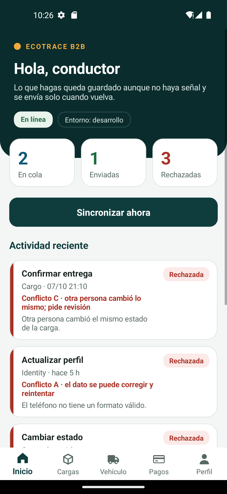
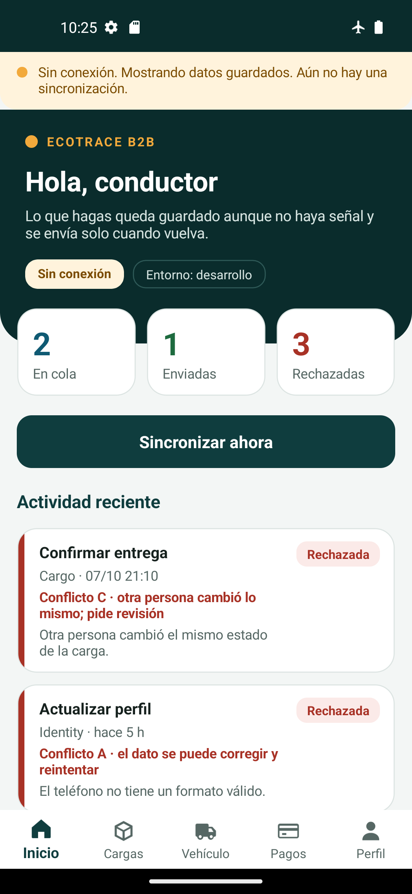
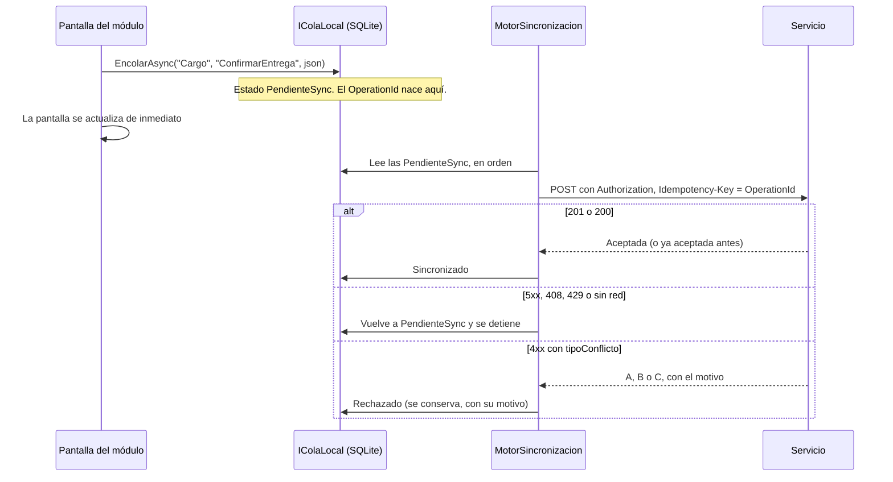

# El esqueleto de la app del conductor

Lo que el docente deja listo para el Trabajo 3, según la [especificación](especificacion.md#base-de-código-y-lo-que-entrega-el-docente): una biblioteca con la parte difícil de lo offline-first ya resuelta y probada, y una app MAUI con el menú, el banner de «Sin conexión» y un módulo vacío por escuadrón. Cada escuadrón trabaja en su carpeta de `Modulos/`.

```
src/
├── EcoTrace.Mobile.Core/        Biblioteca .NET 8, sin MAUI. Se prueba en cualquier máquina.
│   ├── Cola/                    La cola local en SQLite y sus cuatro estados
│   ├── Sincronizacion/          El motor, la clasificación de conflictos A/B/C y los textos
│   ├── Conexion/                El banner «Sin conexión» (lógica y texto)
│   └── Modulos/                 IModuloApp, el registro de módulos y la configuración de entorno
└── EcoTrace.App/                La app MAUI (Android)
    ├── Modulos/
    │   ├── Identity/            ← escuadrón de Identity
    │   ├── Fleet/               ← escuadrón de Fleet Management
    │   ├── Cargo/               ← escuadrón de Cargo & Tracking
    │   └── Billing/             ← escuadrón de Billing & Escrow
    ├── Controles/               Piezas de pantalla compartidas (banner, encabezado, lista de la cola)
    ├── Paginas/                 La pantalla de inicio
    ├── Configuracion/           appsettings de desarrollo y de producción
    └── MauiProgram.cs, AppShell.xaml, App.xaml   Archivos compartidos
```

<p>
  
  
</p>

*La pantalla de inicio en un emulador, con y sin conexión. Las acciones de la lista son datos de ejemplo sembrados a mano en la cola para revisar los estados.*

## Cómo se corre

Requisitos: SDK de .NET 8, el workload de MAUI para Android y un emulador (o un teléfono) con Android 7 o superior.

```bash
dotnet workload install maui-android
```

1. Levanta la plataforma: `scripts/run-all.ps1` (o `.sh`). Los servicios quedan en los puertos 5101 a 5104.
2. Compila y despliega la app en el emulador:

```bash
dotnet build src/EcoTrace.App/EcoTrace.App.csproj -f net8.0-android -t:Run
```

3. Desde el emulador, el computador donde corre la plataforma se ve como `10.0.2.2`. Por eso `Configuracion/appsettings.Desarrollo.json` apunta ahí.

Las pruebas de `Mobile.Core` no necesitan nada de eso y corren con el resto: `dotnet test EcoTrace.sln`.

`EcoTrace.App` no está en `EcoTrace.sln` a propósito: compilarla pide el workload de MAUI y el SDK de Android, que el ejecutor por defecto de GitHub Actions no trae. Para trabajar en la app abre **`EcoTrace.Mobile.sln`**, que tiene la app, el `Mobile.Core` y sus pruebas.

## Cómo funciona una acción, de punta a punta



Lo que el `Mobile.Core` ya garantiza, cada punto con su prueba en `tests/EcoTrace.Mobile.Tests`:

- **El `OperationId` nace al guardar**, no al sincronizar. Un reintento reenvía la misma clave.
- **Se sincroniza en el orden en que se encoló.** Si una falla por red o por un `5xx`, el motor se detiene: no manda la siguiente antes que la anterior.
- **Un rechazo del servidor no bloquea la cola.** Pasa a `Rechazado` con su tipo de conflicto y su motivo, y se sigue con la siguiente.
- **Nunca se pierde una acción en silencio.** La interfaz de la cola no tiene un método para borrar, y una rechazada no vuelve a `PendienteSync` por la puerta de atrás.
- **Sin token vigente no se envía nada.** Las acciones esperan; nunca se autorizan con un token vencido.
- **Si la app se cierra a mitad de un envío**, la acción vuelve a `PendienteSync` al arrancar y se reenvía con el mismo `OperationId`.
- **Los encabezados del contrato los pone el motor**, no el módulo: `Authorization`, `Idempotency-Key` y `X-Correlation-Id`.

### Qué hace el motor con cada respuesta

| El servidor responde | Estado de la acción | Y además |
|---|---|---|
| `200` o `201` | `Sincronizado` | |
| `401` | sigue `PendienteSync` | Avisa a la sesión (Identity decide) y detiene la sincronización. |
| `5xx`, `408`, `429`, o sin red | sigue `PendienteSync` | Cuenta el intento y detiene la sincronización. |
| `400` o `409` con `tipoConflicto` | `Rechazado` con ese tipo | A se puede corregir y reintentar, B lo decidió el servidor, C pide revisión. |
| `400` o `409` **sin** `tipoConflicto` | `Rechazado` | Por defecto un `400` es A y un `409`, `404` o `410` es B. Nunca se supone C. |
| `403` | `Rechazado` | Sin tipo de conflicto: es un problema de permisos. |

## Qué le toca a cada escuadrón

Todo lo tuyo va en `EcoTrace.App/Modulos/<TuModulo>/`. Cada carpeta trae cuatro archivos para empezar:

| Archivo | Para qué |
|---|---|
| `Modulo<X>.cs` | Declara el módulo y las acciones que encola (`Manejadores`). |
| `Registro<X>.cs` | Registra el módulo y los servicios que solo tú necesitas. |
| `<X>Page.xaml` | Tu pantalla. Reemplaza la tarjeta «Lo que entrega este módulo» por la real. |
| `<X>Page.xaml.cs` | El código de la pantalla. |

La carpeta de Identity trae además `ProveedorDeSesionIdentity.cs`: hoy devuelve «no hay sesión» y el motor no envía nada. **Identity lo reemplaza** leyendo el token de `SecureStorage`, renovándolo con el refresh token si venció y devolviendo `null` si no puede.

Una prueba de arquitectura (`Cada_modulo_de_la_app_trabaja_solo_en_su_carpeta`) falla si el código de un módulo usa el de otro.

### Ejemplo: encolar la confirmación de una entrega (Cargo)

1. Un manejador que convierte la acción en una solicitud. No pone encabezados:

```csharp
public sealed class ConfirmarEntregaHandler(ConfiguracionServicios servicios) : IManejadorOperacion
{
    public string Modulo => "Cargo";
    public string Tipo => "ConfirmarEntrega";

    public HttpRequestMessage Construir(OperacionPendiente operacion)
    {
        var datos = JsonSerializer.Deserialize<DatosEntrega>(operacion.Payload)!;
        return new HttpRequestMessage(HttpMethod.Post, new Uri(servicios.Cargo, $"/api/cargas/{datos.CargaId}/seguimientos"))
        {
            Content = JsonContent.Create(new { estado = "Entregado", ubicacion = datos.Ubicacion })
        };
    }
}

public sealed record DatosEntrega(Guid CargaId, string Ubicacion);
```

2. Lo declaras en tu módulo:

```csharp
public sealed class ModuloCargo : ModuloBase
{
    public ModuloCargo(ConfiguracionServicios servicios) =>
        Manejadores = [new ConfirmarEntregaHandler(servicios)];

    public override IReadOnlyList<IManejadorOperacion> Manejadores { get; }
    // ...
}
```

3. Desde la pantalla, cuando el conductor pulsa «Entregado»:

```csharp
await _cola.EncolarAsync("Cargo", "ConfirmarEntrega",
    JsonSerializer.Serialize(new DatosEntrega(cargaId, "Popayán")));
// La pantalla se actualiza ya. El motor la envía cuando haya señal.
```

Lo que te falta del lado del servidor, y es parte del trabajo de tu escuadrón: que la ruta lea el `Idempotency-Key` y responda `200` con el resultado anterior si ya la procesó, y que cuando rechace diga `tipoConflicto` en el `ProblemDetails`. La ruta de seguimientos de hoy no lo hace todavía.

## El banner «Sin conexión»

Es un solo componente. Su texto y su lógica están en `BannerSinConexion` (Mobile.Core) y su vista, `BannerSinConexionView`, está puesta en la plantilla de **toda** página (`App.xaml`), así que aparece solo en tus pantallas sin que hagas nada. El texto es el de la especificación: *«Sin conexión. Mostrando datos guardados. Última sincronización: 10:30 a. m.»*

La «última sincronización» es el último contacto real con el servidor: la registra el motor con cada respuesta, y tus pantallas deberían registrarla también cuando refrescan su caché (`IColaLocal.RegistrarSincronizacionAsync`).

## Los entornos

La app lee su dirección y su entorno del `appsettings.json` que el build incrusta: el de **desarrollo** (`Configuracion/appsettings.Desarrollo.json`) en Debug y el de **producción** (`appsettings.Produccion.json`) en Release. Ninguna dirección vive como constante en el código. La pantalla de inicio muestra el entorno en el que corre, y eso es lo primero que mira la Capa 1 de la verificación del release (ADR 0006).

Android solo deja hablar en `http` con `10.0.2.2` (el computador del desarrollador). Cualquier otra dirección tiene que ir por `https` (`Platforms/Android/Resources/xml/network_security_config.xml`).

## Archivos compartidos

`MauiProgram.cs`, `AppShell.xaml`, `App.xaml`, `Controles/`, `Mobile.Core/` y `Configuracion/` son de todos. Se cambian por PR revisado por el docente, con la razón en la descripción. Si necesitas algo del `Mobile.Core` que no está, abre un Issue: lo que se agrega ahí lo usan los cuatro módulos.

## Lo que el esqueleto no incluye

- El inicio de sesión, `SecureStorage`, la sesión offline degradada y la biometría (Identity).
- Ninguna pantalla real de un módulo.
- Las rutas nuevas del servidor (`/api/vehiculos/{id}/novedades`, `/api/pagos/{id}/evidencias`) ni el `Idempotency-Key` en los servicios.
- Resolver los conflictos B y C en pantalla: el motor los clasifica y los conserva; mostrarlos y decidir qué hacer es de cada módulo.
- El pipeline de release (`app-release.yml`, `verificar-release.ps1`, la firma): es de los tres escuadrones de despliegue.
- Iconos y diseño definitivos. Los colores son los de la [guía de marca](../brand/README.md).

## Qué se verificó y qué no

- **Verificado:** las 98 pruebas del `Mobile.Core` en Windows; el `Mobile.Core` y las pruebas de arquitectura de la app corren en el CI.
- **Verificado:** la app compila y corre en un emulador de Android 13 (Pixel 5). Se revisaron a ojo la pantalla de inicio, una pantalla de módulo, el banner de «Sin conexión» en modo avión (con el texto largo en dos líneas) y la lista de la cola con acciones de ejemplo en los cuatro estados y los tres tipos de conflicto. Esa compilación se hizo con el SDK de .NET 10 (`net10.0-android`) porque la máquina donde se armó no tenía el workload de MAUI de .NET 8.
- **No verificado:** compilar con `net8.0-android`, que es el objetivo del proyecto. Si en tu máquina falla algo que debería funcionar, abre un Issue con el mensaje completo.
- **No verificado:** el motor de sincronización dentro de la app contra un servicio real. Sus reglas están probadas en `Mobile.Core` con un servidor falso, pero ninguna acción real está encolada todavía y el inicio de sesión no existe, así que desde la app hoy no se envía nada.
- **No verificado:** el modo Release de la app ni la configuración de producción incrustada.
