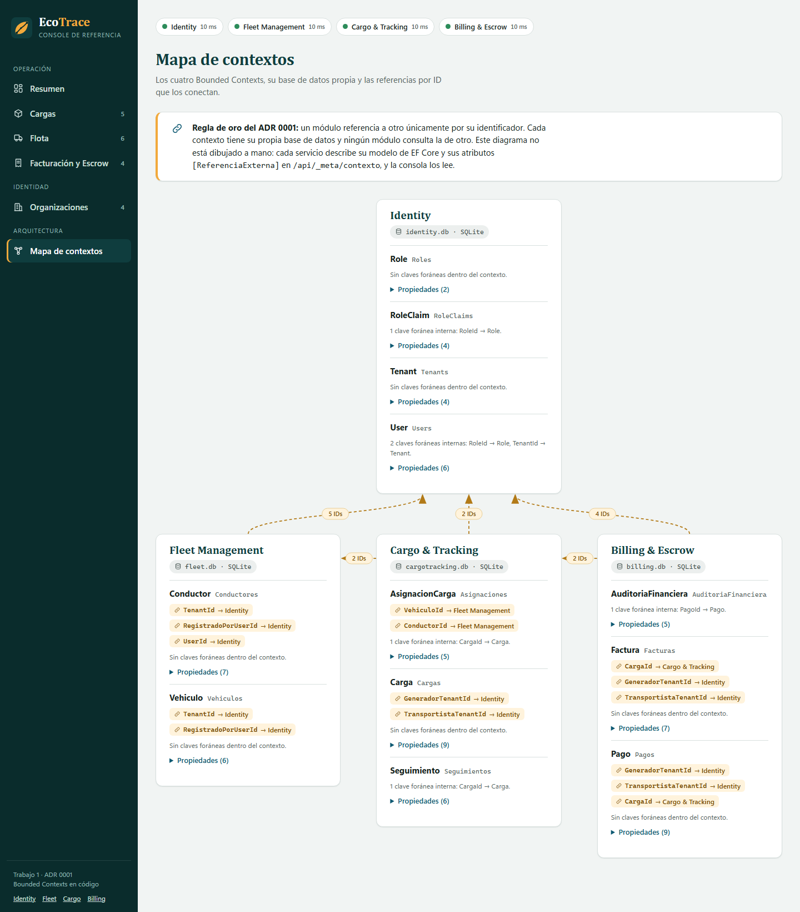

# EcoTrace B2B · Solución de referencia del Trabajo 1

Cuatro Bounded Contexts en .NET 8 (Identity, Fleet Management, Cargo & Tracking y Billing & Escrow) que se relacionan solo por identificador, y una consola web para verlos funcionar. Implementa lo decidido en el [ADR 0001](../../docs/adr/0001-monolito-vs-microservicios.md) con el alcance del [Issue #22](https://github.com/CSA-DanielVillamizar/ecotrace-b2b-core/issues/22).

La construyó el docente para calibrar la rúbrica del Trabajo 1 y se publica después de calificar, para que cada equipo la compare con su entrega. No es la única forma válida de resolverlo: la rúbrica evalúa el principio arquitectónico, no los nombres de carpetas o clases de esta solución.



El diagrama de arriba no está dibujado a mano. Cada servicio publica su modelo de EF Core y las referencias externas que declara, y la consola lo dibuja.

## Cómo ejecutarla

Requiere el SDK de .NET 8. Docker es opcional.

```powershell
# Windows (PowerShell)
.\scripts\run-all.ps1
```

```bash
# macOS, Linux o Git Bash
./scripts/run-all.sh
```

```bash
# Con Docker
docker compose up --build
```

Después se abre <http://localhost:5100> y se pulsa **Cargar datos de ejemplo**, que crea organizaciones, flota, cargas en distintos estados y pagos llamando a la API de cada servicio.

| Servicio | Puerto | Base de datos | Swagger |
|---|---|---|---|
| Consola web | 5100 | | |
| Identity | 5101 | `identity.db` | <http://localhost:5101/swagger> |
| Fleet Management | 5102 | `fleet.db` | <http://localhost:5102/swagger> |
| Cargo & Tracking | 5103 | `cargotracking.db` | <http://localhost:5103/swagger> |
| Billing & Escrow | 5104 | `billing.db` | <http://localhost:5104/swagger> |

Cada servicio crea su base SQLite y aplica su migración al arrancar. Para probar:

```bash
dotnet test
```

## Qué hay en la carpeta

```
referencia/trabajo-01/
├── src/
│   ├── EcoTrace.Identity/            Domain · Infrastructure · Api
│   ├── EcoTrace.FleetManagement/     Domain · Infrastructure · Api
│   ├── EcoTrace.CargoTracking/       Domain · Infrastructure · Api
│   ├── EcoTrace.Billing/             Domain · Infrastructure · Api
│   └── EcoTrace.Console/             Consola web (archivos estáticos, sin paso de compilación)
├── tests/EcoTrace.Referencia.Tests/  Integración, flujo entre contextos y arquitectura
├── docs/
│   ├── decisiones-de-diseno.md       Por qué está hecho así, y qué se dejó fuera
│   ├── brand/README.md               Guía de marca y de interfaz de la consola
│   ├── requests.http                 Peticiones de ejemplo
│   └── img/                          Capturas
├── scripts/                          run-all.ps1, run-all.sh, contraste.py
├── Dockerfile · docker-compose.yml
└── global.json · Directory.Build.props · Directory.Packages.props
```

## Cómo se cumple cada criterio de la rúbrica

| Criterio | Puntos | Dónde está y cómo se comprueba |
|---|---|---|
| Bounded Context respetado | 1,5 | Cuatro bases de datos físicas distintas y ninguna referencia de proyecto entre módulos. Las pruebas `Ningun_proyecto_referencia_a_un_proyecto_de_otro_modulo`, `La_infraestructura_solo_conoce_su_propio_dominio` y `Cada_modulo_declara_su_propio_archivo_de_base_de_datos` fallan si alguien lo rompe. |
| Referencia solo por ID | 1,0 | Cada identificador que apunta a otro contexto es un `Guid` plano marcado con `[ReferenciaExterna]`, sin propiedad de navegación ni clave foránea. Lo hacen cumplir `Todo_identificador_que_apunta_a_otro_contexto_esta_declarado_con_ReferenciaExterna` y `Una_referencia_externa_nunca_es_clave_foranea_ni_apunta_a_su_propio_contexto`. |
| Modelo Tenant/TenantType real | 0,5 | [`Tenant.cs`](src/EcoTrace.Identity/Domain/Tenant.cs) y [`TenantType.cs`](src/EcoTrace.Identity/Domain/TenantType.cs), persistidos en la tabla `Tenants`. Las entidades de dos lados (`Carga`, `Pago`, `Factura`) llevan `GeneradorTenantId` y `TransportistaTenantId`. |
| Repositorio compila y corre | 0,5 | `dotnet build` sin advertencias (`TreatWarningsAsErrors`), los dos scripts `run-all` y `docker compose`. |
| Endpoint real, no stub | 1,0 | Cada API lee y escribe en su propia base de datos. `Del_alta_de_organizaciones_a_la_liberacion_del_pago_solo_con_identificadores` recorre los cuatro contextos de punta a punta. |
| PR con revisión cruzada real | 0,5 | Este criterio evalúa el proceso del equipo (un PR con comentarios sustantivos de otro equipo), no el código, así que no tiene equivalente en esta carpeta. |

## Qué hace la consola

- **Resumen operativo:** indicadores, cargas por estado y fondos en Escrow, reunidos desde los cuatro servicios.
- **Mapa de contextos:** las entidades de cada contexto, sus referencias por ID y las flechas entre contextos, leídas del modelo real.
- **Cargas, flota, pagos y organizaciones:** listas, formularios con validación y errores del servidor, y paneles de detalle con línea de tiempo.
- **Estado de los servicios:** un indicador por servicio y un aviso si alguno no responde. Las demás pantallas siguen funcionando.

La consola pide cada lista al servicio dueño y resuelve los nombres buscando por identificador. Es una decisión consciente y está explicada en [decisiones-de-diseno.md](docs/decisiones-de-diseno.md).

## Las APIs en resumen

Todas devuelven JSON con los enums como texto y los errores como `ProblemDetails`. Además de lo siguiente, cada servicio expone `GET /health` y `GET /api/_meta/contexto`.

| Servicio | Endpoints |
|---|---|
| Identity | `POST` y `GET /api/tenants`, `GET /api/tenants/{id}`, `POST` y `GET /api/users`, `GET /api/users/{id}`, `GET /api/roles` |
| Fleet Management | `POST` y `GET /api/vehiculos`, `GET /api/vehiculos/{id}`, `POST` y `GET /api/conductores`, `GET /api/conductores/{id}` |
| Cargo & Tracking | `POST` y `GET /api/cargas`, `GET /api/cargas/{id}`, `POST /api/cargas/{id}/asignacion`, `POST` y `GET /api/cargas/{id}/seguimientos` |
| Billing & Escrow | `POST` y `GET /api/pagos`, `GET /api/pagos/{id}`, `POST /api/pagos/{id}/liberar`, `POST /api/pagos/{id}/reembolso`, `GET /api/pagos/{id}/auditoria`, `POST` y `GET /api/facturas`, `GET /api/facturas/{id}` |

Las peticiones de ejemplo están en [docs/requests.http](docs/requests.http).

## Lo que no está

Autenticación, comunicación entre servicios, mensajería y Saga son de los Trabajos 2 y 3, y no se adelantaron. Hoy los servicios aceptan el `TenantId` que llega en la solicitud sin verificarlo y no comprueban que las referencias a otros contextos existan. Ambas cosas son deliberadas y se explican en [decisiones-de-diseno.md](docs/decisiones-de-diseno.md#5-el-tenantid-llega-en-el-cuerpo-de-la-solicitud).

## Documentos

- [Decisiones de diseño](docs/decisiones-de-diseno.md)
- [Guía de marca y de interfaz](docs/brand/README.md)
- [Peticiones de ejemplo](docs/requests.http)
